```mermaid
graph LR
    A[🔧 Assemble Device] --> B[💻 Solution Builder]
    B --> C[âš¡ Flash Firmware]
    C --> D[📡 SoftAP Config]
    D --> E[🠠HA Discovery]
    E --> F[ğŸ·ï¸ Tags & Areas]
    F --> G[📊 Dashboard & Energy]
    
    style A fill:#e1f5fe
    style B fill:#f3e5f5
    style C fill:#fff3e0
    style D fill:#e8f5e8
    style E fill:#fce4ec
    style F fill:#f1f8e9
    style G fill:#e3f2fd
```

# Smart Device Solution Builder — Plug & Play Integration with Home Assistant 🏠

> **No code. No YAML. Just plug, flash, and go.**  
> *Updated for Home Assistant 2025.11 - Now with Enhanced Discovery, Tags, and Modern Dashboards*


This README documents how to use the **Carenuity Solution Builder** to convert assembled smart devices into plug-and-play components for **Home Assistant**. The workflow below assumes the user will use **Google Chrome** and the IoT Triple Selector to connect their assembled device.

## 🏷️ Supported Device Categories

The Carenuity ecosystem supports multiple device types that integrate seamlessly with Home Assistant:

- **🌡️ Climate Sensors** - Temperature, Humidity, Air Quality
- **💡 Smart Lighting** - Switches, Dimmers, RGB Controllers  
- **🔌 Power Management** - Smart Plugs, Energy Monitors
- **🚪 Security Devices** - Motion Sensors, Door/Window Sensors
- **📷 Vision Systems** - ESP32-CAM based monitoring
- **🌿 Environmental** - Soil Moisture, Light Level Sensors

---

## ⚡ Quick Summary

1. Open the **Solution Builder** in Chrome
2. Connect your assembled device using the **IoT Triple Selector**
3. Select the matching solution and install firmware via Web Serial
4. Press **Reset** → device creates a SoftAP (Access Point)
5. Connect to the SoftAP and configure local Wi‑Fi credentials
6. Device goes online and is **automatically discovered** by Home Assistant
7. Configure with modern **Areas**, **Labels**, and **Tags** for enhanced organization
8. Add to **Energy Dashboard** and create automations with the new UI

---

## 🌐 Platform Access

**Carenuity Solution Builder:** [`solutions.carenuity.com`](https://solutions.carenuity.com/ecosystems/icoKdkS26vPY0YcSyASM)


### Supported Microcontrollers (2025)
- **ESP32** / **ESP32-S3** - Full featured with Wi-Fi & Bluetooth
- **ESP32-CAM** - Vision and monitoring applications  
- **C3-Mini** / **D1-Mini** - Compact sensor nodes
- **Raspberry Pi Pico W** - Alternative platform support

> 💡 **Best Experience:** Use **Google Chrome** (Desktop) for optimal Web Serial compatibility and firmware flashing.

---

## Detailed Steps (for README usage)

### 1. Open Solution Builder

* Navigate to the platform link in Chrome.

### 2. Connect the Device

* Plug the assembled board (e.g., **S‑M‑A**) into the triple adapter and connect to your computer.

### 3. Select Solution & Install Firmware

* From the list of solutions choose the one matching your hardware (e.g., **Air Quality Meter**).
* Click **Install Firmware** to flash the device using the browser's Web Serial interface.
* Wait for the flashing process to complete.

### 4. Press RESET → SoftAP Created

* After flashing press the device **Reset** button.
* The device will create a SoftAP (Wi‑Fi access point) named after the device, for example:

```
AIRQuality-Meter
```

### 5. Connect to the AP & Provision Wi‑Fi

* Connect a phone/laptop to the SoftAP.
* An auto‑opened captive portal or the browser will show a configuration page.
* Enter your local Wi‑Fi SSID and password and submit.
* The device will reboot and join your network.

### 6. Home Assistant Auto-Discovery 🔍

* Once connected to your network, the device will advertise itself via **mDNS/Zeroconf**
* Home Assistant will automatically detect it and show a **"New device discovered"** notification
* If you miss the notification: `Settings → Devices & Services → Add Integration → Browse discovered`


### 7. Modern Configuration & Organization 🏷️

**Enhanced Device Setup (2025 Features):**

* **Areas** - Assign device to specific rooms (Kitchen, Living Room, etc.)
* **Labels** - Tag devices by function (Climate, Security, Energy)  
* **Categories** - Automatic sorting by device type
* **Energy Dashboard** - Power monitoring devices auto-integrate
* **Voice Control** - Instant compatibility with Alexa/Google Assistant

**Dashboard Integration:**
```yaml
# Modern Dashboard Card Example
type: entities
title: "Smart Air Quality Monitor"
show_header_toggle: false
entities:
  - entity: sensor.air_quality_pm25
    name: "PM2.5"
    icon: mdi:air-filter
  - entity: sensor.air_quality_temperature  
    name: "Temperature"
  - entity: sensor.air_quality_humidity
    name: "Humidity"
area: living_room
labels: [climate, monitoring]
```


---

## 🛠️ Troubleshooting & Advanced Features

### Common Issues
* **No SoftAP after reset:** Verify power connection, retry firmware flash, check device compatibility
* **Captive portal doesn't appear:** Manually navigate to `http://192.168.4.1` in browser  
* **HA Discovery fails:** Check `Settings → System → Network` for mDNS, restart HA Core if needed
* **Firmware conflicts:** Use Chrome's "Reset to bootloader" before flashing new firmware

### 2025 Integration Features

**📊 Energy Dashboard Integration:**
- Power monitoring devices automatically appear in Energy settings
- Historical consumption tracking and cost calculation
- Solar/battery integration for renewable energy setups

**🏠 Area & Zone Management:**
```yaml
# Automatic area assignment based on device name
homeassistant:
  customize:
    sensor.kitchen_air_quality:
      area_id: kitchen
      labels: [climate, monitoring]
      category: diagnostic
```

**🔔 Advanced Automation Triggers:**
- Device state changes trigger area-based scenes
- Energy thresholds for cost management  
- Air quality alerts with actionable notifications

---

## 🎯 Best Practices (2025 Edition)

### Device Preparation
* ✅ **Pre-flash verification** - Match device model with solution template  
* ✅ **Naming convention** - Use descriptive names: `kitchen_air_quality` vs `device_001`
* ✅ **Chrome requirement** - Desktop version ensures optimal Web Serial performance
* ✅ **Power stability** - Use quality USB cables and stable power during flashing

### Home Assistant Organization  
* 🏷️ **Strategic tagging** - Use consistent labels: `climate`, `security`, `energy`
* 📍 **Area mapping** - Assign devices to areas before first use
* 🔄 **OTA updates** - Enable automatic firmware updates via Solution Builder
* 📊 **Dashboard planning** - Group related sensors in themed dashboard cards

### Integration Optimization
```yaml
# Example: Optimized device configuration
sensor:
  - platform: template
    sensors:
      air_quality_index:
        friendly_name: "Living Room AQI"
        value_template: "{{ states('sensor.air_quality_pm25')|float * 2.5 }}"
        unit_of_measurement: "AQI"
        device_class: "aqi"
```

---

## 📱 Modern Integration Workflow

### Enhanced 2025 Process Flow


### Visual Workflow Diagram

```html
<svg width="800" height="280" xmlns="http://www.w3.org/2000/svg" viewBox="0 0 800 280">
  <style> 
    .box { fill:#f8f9fa; stroke:#0d47a1; stroke-width:2; rx:12; } 
    .text { font-family: -apple-system, BlinkMacSystemFont, 'Segoe UI', Roboto, Arial; font-size:14px; fill:#1565c0; font-weight:500; }
    .subtext { font-family: -apple-system, BlinkMacSystemFont, 'Segoe UI', Roboto, Arial; font-size:11px; fill:#424242; }
    .modern-arrow { stroke:#1976d2; stroke-width:3; }
  </style>

  <!-- 2025 Modern Workflow Boxes -->
  <rect class="box" x="20" y="40" width="140" height="80" rx="12"></rect>
  <text class="text" x="90" y="70" text-anchor="middle">🔧 Device Assembly</text>
  <text class="subtext" x="90" y="90" text-anchor="middle">ESP32 + Sensors</text>
  <text class="subtext" x="90" y="105" text-anchor="middle">IoT Triple Selector</text>

  <rect class="box" x="190" y="40" width="140" height="80" rx="12"></rect>
  <text class="text" x="260" y="70" text-anchor="middle">💻 Carenuity Portal</text>
  <text class="subtext" x="260" y="90" text-anchor="middle">Chrome Web Serial</text>
  <text class="subtext" x="260" y="105" text-anchor="middle">Solution Templates</text>

  <rect class="box" x="360" y="40" width="140" height="80" rx="12"></rect>
  <text class="text" x="430" y="70" text-anchor="middle">📡 Wi-Fi Setup</text>
  <text class="subtext" x="430" y="90" text-anchor="middle">Captive Portal</text>
  <text class="subtext" x="430" y="105" text-anchor="middle">Network Credentials</text>

  <rect class="box" x="530" y="40" width="140" height="80" rx="12"></rect>
  <text class="text" x="600" y="70" text-anchor="middle">🔍 Auto Discovery</text>
  <text class="subtext" x="600" y="90" text-anchor="middle">mDNS Broadcast</text>
  <text class="subtext" x="600" y="105" text-anchor="middle">ESPHome/MQTT</text>

  <!-- Home Assistant Integration Panel -->
  <rect class="box" x="150" y="160" width="480" height="100" rx="12" style="fill:#e8f5e8; stroke:#2e7d32;"></rect>
  <text class="text" x="390" y="185" text-anchor="middle" style="fill:#2e7d32; font-size:16px;">🏠 Home Assistant 2025 Integration</text>
  
  <text class="subtext" x="200" y="210" style="fill:#1b5e20;">📍 Areas & Zones</text>
  <text class="subtext" x="320" y="210" style="fill:#1b5e20;">🏷️ Labels & Tags</text>
  <text class="subtext" x="450" y="210" style="fill:#1b5e20;">📊 Energy Dashboard</text>
  <text class="subtext" x="570" y="210" style="fill:#1b5e20;">🔔 Automations</text>
  
  <text class="subtext" x="200" y="235" style="fill:#1b5e20;">🎨 Modern UI Cards</text>
  <text class="subtext" x="320" y="235" style="fill:#1b5e20;">📱 Mobile App Sync</text>
  <text class="subtext" x="450" y="235" style="fill:#1b5e20;">🗣️ Voice Control</text>
  <text class="subtext" x="570" y="235" style="fill:#1b5e20;">☁️ Cloud Backup</text>

  <!-- Modern Arrows -->
  <defs>
    <marker id="modern-arrow" markerWidth="12" markerHeight="12" refX="8" refY="6" orient="auto">
      <path d="M2 2 L10 6 L2 10 z" fill="#1976d2"/>
    </marker>
  </defs>

  <line x1="160" y1="80" x2="190" y2="80" class="modern-arrow" marker-end="url(#modern-arrow)" />
  <line x1="330" y1="80" x2="360" y2="80" class="modern-arrow" marker-end="url(#modern-arrow)" />
  <line x1="500" y1="80" x2="530" y2="80" class="modern-arrow" marker-end="url(#modern-arrow)" />
  <line x1="600" y1="120" x2="600" y2="160" class="modern-arrow" marker-end="url(#modern-arrow)" />

</svg>
```

### Integration Screenshots


*Automatic device discovery notification in Home Assistant 2025*

  
*Example dashboard with Carenuity devices using modern card layouts*

## 🚀 Advanced Examples & Templates

### Smart Air Quality Monitor Setup
```yaml
# Home Assistant configuration.yaml snippet
homeassistant:
  customize:
    sensor.carenuity_air_quality_pm25:
      friendly_name: "Living Room Air Quality"
      icon: mdi:air-filter
      device_class: "pm25"
    sensor.carenuity_air_quality_temperature:
      friendly_name: "Living Room Temperature" 
      device_class: "temperature"

# Dashboard card configuration
type: custom:mini-graph-card
entities:
  - sensor.carenuity_air_quality_pm25
  - sensor.carenuity_air_quality_temperature
  - sensor.carenuity_air_quality_humidity
name: "Air Quality Trends"
hours_to_show: 24
points_per_hour: 4
line_width: 2
```

### Energy Monitoring Integration
```yaml
# Energy dashboard configuration for smart plugs
energy:
  sources:
    - type: grid
      flow_from:
        - sensor.carenuity_smart_plug_energy
      cost_entity: sensor.electricity_cost
```

### Automation Examples
```yaml
# Smart air quality automation
automation:
  - alias: "Poor Air Quality Alert"
    trigger:
      platform: numeric_state
      entity_id: sensor.carenuity_air_quality_pm25
      above: 50
    action:
      - service: notify.mobile_app
        data:
          message: "⚠️ Air quality is poor in {{ trigger.to_state.attributes.friendly_name }}"
          title: "Air Quality Alert"
          data:
            push:
              category: "air_quality"
              thread-id: "air-quality-alerts"
```

---

## 📋 Device Compatibility Matrix

| Device Type | Microcontroller | Sensors | HA Discovery | Energy Dashboard | Voice Control |
|-------------|----------------|---------|--------------|------------------|---------------|
| 🌡️ Climate Monitor | ESP32/C3 | DHT22, BME280 | ✅ Auto | ➖ N/A | ✅ Alexa/Google |
| 💡 Smart Switch | ESP32 | Relay, Current | ✅ Auto | ✅ Power Tracking | ✅ Voice Commands |
| 🔌 Smart Plug | D1-Mini | PZEM-004T | ✅ Auto | ✅ Energy Monitor | ✅ On/Off Control |
| 📷 Security Camera | ESP32-CAM | OV2640 | ✅ Auto | ➖ Low Power | ✅ View Stream |
| 🌿 Plant Monitor | Pico W | Soil/Light | ✅ Auto | ➖ Battery | ✅ Status Check |

---

## 🔗 Additional Resources

### Official Links
- **🌐 Carenuity Platform:** [solutions.carenuity.com](https://solutions.carenuity.com/)
- **📖 Home Assistant Docs:** [home-assistant.io](https://www.home-assistant.io/)
- **👥 Community Forum:** [community.home-assistant.io](https://community.home-assistant.io/)

### Development Resources  
- **🛠️ ESPHome:** [esphome.io](https://esphome.io/) - Alternative firmware platform
- **📱 HA Mobile Apps:** [iOS](https://apps.apple.com/app/home-assistant/id1099568401) | [Android](https://play.google.com/store/apps/details?id=io.homeassistant.companion.android)
- **🔧 Web Serial API:** [developer.chrome.com](https://developer.chrome.com/articles/serial/)

---

## 📄 License & Contribution

**© 2025 ChipGlobe GmbH** - ChipGlobe™ and Carenuity™ are trademarks of ChipGlobe GmbH

### Contributing
- 🔄 **Submit Issues:** Report bugs or request features via GitHub issues
- 🚀 **Pull Requests:** Improve device recipes, documentation, and integration examples  
- 💬 **Community:** Join discussions in Home Assistant forums
- 📖 **Documentation:** Help translate and improve setup guides

### Supported Ecosystems
- ✅ **Home Assistant** - Primary integration target
- ✅ **ESPHome** - Alternative firmware approach
- ✅ **Matter/Thread** - Future compatibility planned  
- ✅ **Cloud-free** - Local-only operation supported

---

*Last updated: November 2025 | Compatible with Home Assistant 2025.11+*
